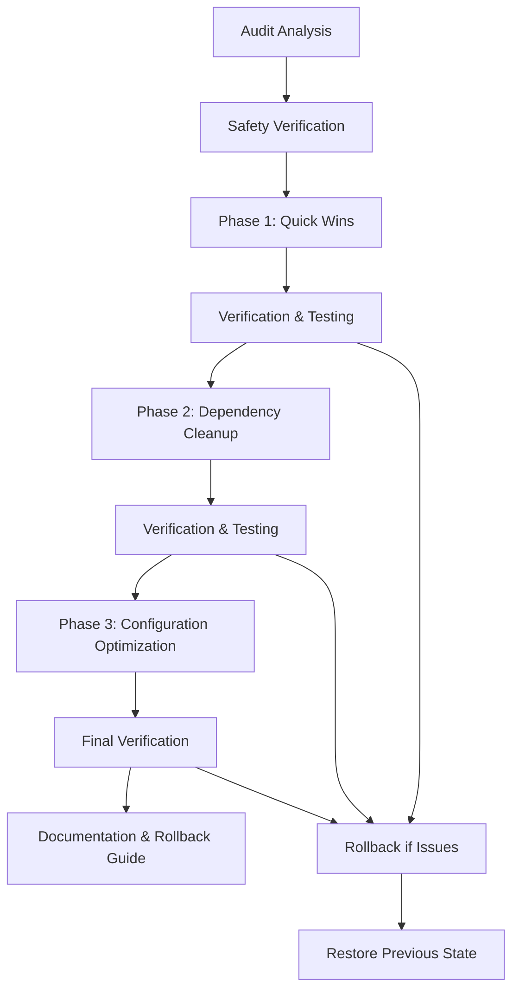

# Design Document

## Overview

This design document outlines the systematic approach to cleaning up the Honda Permata Next.js project based on audit findings. The cleanup will be performed in carefully orchestrated phases to ensure zero functionality disruption while achieving significant optimization benefits.

The design prioritizes safety through verification steps, rollback capabilities, and incremental changes that can be tested at each stage.

## Architecture

### Cleanup Pipeline Architecture



### Safety-First Approach

1. **Pre-cleanup Verification**: Analyze current functionality
2. **Incremental Changes**: Small, testable modifications
3. **Continuous Verification**: Test after each change
4. **Rollback Capability**: Maintain ability to revert changes
5. **Documentation**: Record all changes for future reference

## Components and Interfaces

### 1. File Analysis Component

**Purpose**: Analyze file usage and dependencies before removal

**Interface**:
```typescript
interface FileAnalyzer {
  analyzeImports(filePath: string): ImportAnalysis
  findReferences(filePath: string): Reference[]
  verifyUnused(filePath: string): boolean
  getSafeToDelete(filePaths: string[]): string[]
}

interface ImportAnalysis {
  imports: string[]
  exports: string[]
  usedBy: string[]
  dependencies: string[]
}
```

### 2. Dependency Manager Component

**Purpose**: Safely manage package.json dependencies

**Interface**:
```typescript
interface DependencyManager {
  analyzeUsage(packageName: string): UsageAnalysis
  findUnusedDependencies(): string[]
  pinLatestVersions(): VersionUpdate[]
  verifyRemovalSafety(packages: string[]): SafetyReport
}

interface UsageAnalysis {
  isUsed: boolean
  usageLocations: string[]
  importedBy: string[]
  runtimeRequired: boolean
}
```

### 3. Build Verification Component

**Purpose**: Ensure changes don't break functionality

**Interface**:
```typescript
interface BuildVerifier {
  runDevelopmentBuild(): BuildResult
  runProductionBuild(): BuildResult
  verifyAllRoutes(): RouteVerification[]
  checkBundleSize(): BundleSizeReport
}

interface BuildResult {
  success: boolean
  errors: string[]
  warnings: string[]
  buildTime: number
}
```

### 4. Rollback Manager Component

**Purpose**: Provide safe rollback capabilities

**Interface**:
```typescript
interface RollbackManager {
  createCheckpoint(phase: string): Checkpoint
  rollbackToCheckpoint(checkpointId: string): RollbackResult
  listCheckpoints(): Checkpoint[]
  cleanupCheckpoints(): void
}

interface Checkpoint {
  id: string
  phase: string
  timestamp: Date
  files: FileSnapshot[]
  packageJson: PackageSnapshot
}
```

## Data Models

### File Cleanup Model

```typescript
interface CleanupPlan {
  phase: CleanupPhase
  filesToRemove: FileRemoval[]
  dependenciesToRemove: DependencyRemoval[]
  configurationsToUpdate: ConfigUpdate[]
  verificationSteps: VerificationStep[]
}

interface FileRemoval {
  filePath: string
  reason: string
  safetyVerified: boolean
  backupLocation?: string
  rollbackInstructions: string
}

interface DependencyRemoval {
  packageName: string
  currentVersion: string
  reason: string
  usageVerified: boolean
  impactAssessment: string
}
```

### Verification Model

```typescript
interface VerificationResult {
  phase: string
  success: boolean
  issues: Issue[]
  performance: PerformanceMetrics
  functionalityCheck: FunctionalityCheck
}

interface Issue {
  type: 'error' | 'warning' | 'info'
  description: string
  file?: string
  solution?: string
}

interface PerformanceMetrics {
  bundleSizeBefore: number
  bundleSizeAfter: number
  buildTimeBefore: number
  buildTimeAfter: number
  nodeModulesSizeBefore: number
  nodeModulesSizeAfter: number
}
```

## Error Handling

### Error Categories

1. **Build Errors**: TypeScript compilation or build failures
2. **Runtime Errors**: Application crashes or functionality breaks
3. **Import Errors**: Missing dependencies or incorrect imports
4. **Asset Errors**: Missing images or resources

### Error Handling Strategy

```typescript
interface ErrorHandler {
  handleBuildError(error: BuildError): ErrorResolution
  handleRuntimeError(error: RuntimeError): ErrorResolution
  handleImportError(error: ImportError): ErrorResolution
  handleAssetError(error: AssetError): ErrorResolution
}

interface ErrorResolution {
  action: 'rollback' | 'fix' | 'ignore'
  steps: string[]
  preventionMeasure: string
}
```

### Rollback Triggers

- Any build failure
- Runtime errors in critical paths
- Missing imports that break functionality
- Visual layout disruptions
- Performance degradation > 20%

## Testing Strategy

### 1. Pre-Cleanup Testing

**Baseline Establishment**:
- Document current build times
- Capture bundle sizes
- Screenshot all pages
- Test all interactive elements
- Record performance metrics

### 2. Incremental Testing

**After Each Phase**:
- Run development build
- Run production build
- Test all routes manually
- Verify no console errors
- Compare with baseline screenshots

### 3. Automated Verification

**Build Verification**:
```bash
# Development build test
npm run dev
# Wait for successful startup
curl http://localhost:3000 # Verify homepage loads

# Production build test  
npm run build
npm run start
# Verify all routes accessible
```

**Bundle Analysis**:
```bash
# Analyze bundle size
npm run build
npx @next/bundle-analyzer
```

### 4. Manual Testing Checklist

**Critical Functionality**:
- [ ] Homepage loads correctly
- [ ] All navigation menus work
- [ ] Product pages display properly
- [ ] Contact forms function
- [ ] Mobile responsive design intact
- [ ] All images load correctly
- [ ] No console errors
- [ ] Performance acceptable

### 5. Rollback Testing

**Rollback Verification**:
- Test rollback procedures
- Verify complete restoration
- Ensure no residual issues
- Document rollback time

## Implementation Phases

### Phase 1: Safe File Cleanup (2 hours)

**Scope**: Remove duplicate files and obviously unused components

**Safety Measures**:
- Create git checkpoint before changes
- Verify no imports exist for each file
- Test build after each file removal
- Maintain list of removed files for rollback

**Files to Remove** (verified safe):
- `components/ui/use-mobile.tsx` (duplicate)
- `components/ui/use-toast.ts` (duplicate)
- Unused UI components (after import verification)

### Phase 2: Dependency Optimization (3 hours)

**Scope**: Remove unused dependencies and pin versions

**Safety Measures**:
- Backup original package.json
- Remove one dependency at a time
- Test build after each removal
- Verify no runtime errors

**Dependencies to Remove** (verified unused):
- date-fns, react-day-picker (only used in unused calendar.tsx)
- recharts (only used in unused chart.tsx)
- sonner (only used in unused sonner.tsx)
- vaul, input-otp, cmdk (not used anywhere)

### Phase 3: Configuration Optimization (2 hours)

**Scope**: Update TypeScript and build configurations

**Safety Measures**:
- Backup all configuration files
- Apply changes incrementally
- Test build after each change
- Verify no new errors introduced

**Configurations to Update**:
- Remove build error ignores
- Add TypeScript strict options
- Update ESLint configuration
- Pin "latest" versions

## Risk Mitigation

### High-Risk Areas

1. **Import Path Changes**: Could break component references
2. **Dependency Removal**: Could break runtime functionality
3. **Configuration Changes**: Could introduce build errors

### Mitigation Strategies

1. **Comprehensive Testing**: Test every change immediately
2. **Incremental Approach**: Make small, verifiable changes
3. **Rollback Readiness**: Maintain ability to quickly revert
4. **Documentation**: Record every change for troubleshooting

### Contingency Plans

**If Build Breaks**:
1. Immediately rollback last change
2. Identify root cause
3. Apply targeted fix
4. Re-test before proceeding

**If Functionality Breaks**:
1. Rollback to last working state
2. Analyze what was removed
3. Restore minimal required code
4. Document the dependency

**If Performance Degrades**:
1. Measure specific impact
2. Identify cause of degradation
3. Revert problematic changes
4. Find alternative optimization

## Success Metrics

### Quantitative Metrics

- Bundle size reduction: Target 2MB+ reduction
- Node modules size reduction: Target 80MB+ reduction
- Build time improvement: Target 10%+ faster
- Unused file removal: Target 20+ files removed

### Qualitative Metrics

- Zero functionality regression
- Maintained visual consistency
- Improved code maintainability
- Enhanced developer experience
- Production readiness achieved

## Monitoring and Validation

### Continuous Monitoring

- Build success rate: 100%
- Runtime error rate: 0 new errors
- Performance metrics: No degradation
- User experience: No visual changes

### Validation Checkpoints

1. **After Phase 1**: Verify all pages load correctly
2. **After Phase 2**: Verify all functionality works
3. **After Phase 3**: Verify production build succeeds
4. **Final Validation**: Complete end-to-end testing

This design ensures that the cleanup process is safe, verifiable, and reversible while achieving the optimization goals identified in the audit.